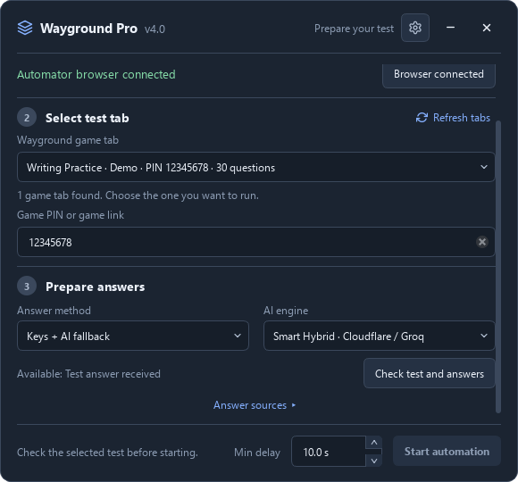
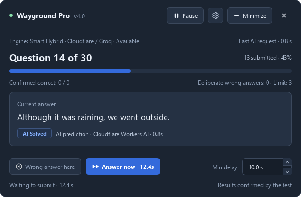
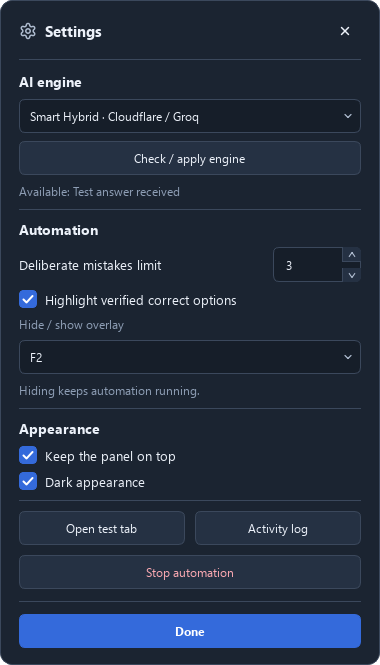
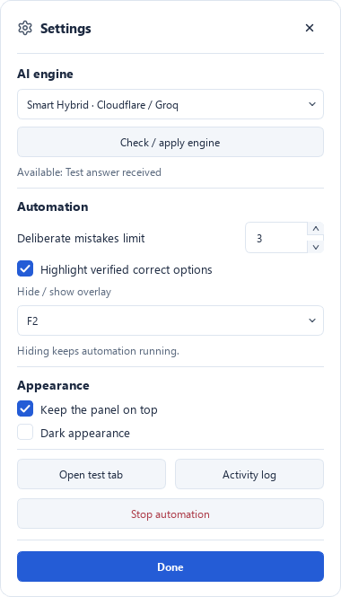

<p align="center">
  
</p>

<p align="center">
  <h1 align="center">🚀 Wayground Pro Automator v4.0</h1>
  <p align="center">
    Automated test-taking on <b>wayground.com</b> with Smart Hybrid AI Solver & Direct API Interception
    <br />
    <a href="#-english">English</a> · <a href="#-русский">Русский</a>
    <br /><br />
    <a href="https://github.com/whyred2/wayground-pro-automator/releases/latest">
      
    </a>
  </p>
</p>

---

## ⚠️ Disclaimer / Отказ от ответственности

> **EN:** This tool is for educational and research purposes only. The developers are not responsible for any misuse or violations of terms of service of the target platforms.

> **RU:** Данный инструмент создан исключительно в образовательных и ознакомительных целях. Разработчики не несут ответственности за любое нарушение правил использования сторонних платформ.

---

## 🇬🇧 English

### Table of Contents

- [What's New in v4.0](#whats-new-in-v40)
- [Desktop Screenshots](#desktop-screenshots)
- [What's New in v3.2.1](#whats-new-in-v321)
- [What's New in v3.2](#whats-new-in-v32)
- [What's New in v3.0.1](#whats-new-in-v301)
- [What's New in v3.0](#whats-new-in-v30)
- [What's New in v2.4](#whats-new-in-v24)
- [What's New in v2.3](#whats-new-in-v23)
- [What's New in v2.2](#whats-new-in-v22)
- [Features](#features)
- [Project Structure](#project-structure)
- [Installation](#installation)
- [Quick Start](#quick-start)
- [CLI Parameters](#cli-parameters)
- [How It Works](#how-it-works)
- [Running Tests](#running-tests)

### What's New in v4.0

- **Native Windows desktop UI** — Double-click the executable or launch without arguments to open the startup window. Connect the dedicated Edge/Chrome browser, select the game tab, and review answer sources and question counts. The interface is in English; the console remains available with `--cli`.
- **Start AI-only on an existing game** — **AI only** can start directly after a real engine availability check, without verified keys, a full API question list, or a known question count. The visible counter supplies progress during the run. The **Game PIN or game link** field also works when a test is already underway.
- **Live panel and compact strip** — Pause/resume, submit one answer with **Answer now**, schedule or undo a deliberate mistake, and adjust timing during execution. The compact strip keeps the current question, pause and Settings controls; it shows an accuracy percentage only when Wayground supplies one. Answer source and AI request time come from the actual operation.
- **Consistent window design** — Rounded outlines, draggable headers, light/dark themes and spaced button icons are shared across the panel and Settings. Windows fit their content and available screen space. **Current answer** preserves the complete text, wraps it, and scrolls longer responses; the engine and request time remain readable.
- **Settings during a run** — Check and switch AI engines for the next AI request, highlight verified correct options, keep the panel on top, and choose a Boss key. F2 hides/restores the overlay while automation continues; the tray icon can restore it too. Settings work from both the full panel and compact strip.
- **Variable minimum delay** — **Min delay** defaults to 10 seconds for new settings. Automatic waiting accounts for question length and ±30% variation, with the selected minimum as its lower bound. Changing the minimum updates the current countdown; **0** skips automatic waiting. Existing saved values are preserved.
- **Mistake limit can return to zero** — Change the limit to **0** at any point, including after a deliberate mistake. This cancels a pending deliberate mistake and prevents further ones while retaining the submitted-mistake history. The panel displays the used count and configured limit separately.
- **Execution stays bound to the selected game** — Normal navigation within the same identified game is allowed. Closing the target tab, reloading its active game page, or switching to another game stops submission and requires fresh preparation. Stop and Exit keep the browser open.
- **Written responses stay manual** — An OPEN question without a fixed key waits for your own response in the test tab, then the desktop run continues after you submit it. The status text is never inserted as an answer. Verified keys, AI predictions and unresolved questions remain distinct.
- **Existing configuration and CLI are retained** — Existing command-line options still work, and personal `.env` configuration can be placed beside the executable. Saved UI preferences contain no passwords, API keys, game identifiers or answer data.

### Desktop Screenshots

These screenshots show the actual desktop windows with demonstration data, not a live account or game session.

| Startup: choose a game and check its answers | Live panel: answer, source and run controls |
| --- | --- |
|  |  |

**Compact strip** — Current question, pause, Settings and Expand remain accessible.


| Settings: dark appearance | Settings: light appearance |
| --- | --- |
|  |  |

### What's New in v3.2.1

- **Search beyond the first results** — When the fast library lookup fails, exact-title search checks additional pages. A matching test beyond the first ten results can now be found automatically; question IDs and content are still verified before keys are accepted.
- **Written responses no longer discard valid keys** — An OPEN question explicitly marked as having no fixed correct answer is retained separately. For example, Technical Writing Quiz now loads 45 verified keys and displays all 46 questions, including one written response.
- **Clear manual-response handling** — The table labels unkeyed written questions, keeps answer-key counts separate from question counts, and stops before filling or submitting them. Enter and submit your own response in the test tab, then run the program again to continue. These questions are not sent to the fill-in-the-blank AI solver.

### What's New in v3.2

- **Separate keys for repeated questions** — Questions with identical wording retain their own IDs, answers, and option sets. A quiz with 51 questions now displays 51 rows instead of grouping repeated prompts. Matching uses question IDs first, then the visible option set when IDs are unavailable; option order can be shuffled.
- **Direct game lookup and verified public quiz keys** — Resolves game PINs, room hashes, quiz IDs, and URLs through the Wayground API. If a game hides its keys, the public library is searched and candidates are checked against the game's question IDs, content, and options. BLANK questions resolve explicit target/option mappings, including multiple blanks and accepted spellings.
- **No fabricated fallback answers** — Missing keys, ambiguous matches, incomplete blank answers, and failed AI requests stop automation before submission. The program no longer substitutes generic `yes` or `answer` fallbacks, repeats a partial answer across blanks, or selects a random option when no answer was found. Waiting timeouts do not count as test completion.
- **AI selection with real availability checks** — Choose Smart Hybrid, Qwen 3.8 27B via Groq, GPT-OSS 120B / 20B, a configured personal API, or no AI before starting. Each engine is checked with a test request. Qwen can use Groq through the gateway without a personal key; GPT-OSS can use the gateway when a Groq key is not configured. GPT-OSS presets are text-only.
- **Stable CheatNetwork fallback** — Offers existing answer tabs after target API lookup fails and preserves user-owned tabs. Waits for `Downloading answers...` for up to five minutes without refreshing; persistent `Not logged in` pauses for manual sign-in. Closed tabs and browsers are handled without continuing automation.
- **Quizit sign-in flow and regression checks** — Optional Quizit Standard fallback uses its website's normal account sign-in and captures the requested result. Unsolved responses are rejected, duplicate requests are avoided, and `--no-bot` disables this fallback. The `tests/` directory covers answer parsing, repeated prompts, navigation, AI failures, tabs, and gateway routing.

### What's New in v3.0.1

- **Cloudflare Workers AI Llama 3.3 70B Model Routing**: Corrected model routing to `@cf/meta/llama-3.3-70b-instruct-fp8-fast`, enabling seamless, full-capacity execution of Meta Llama 3.3 70B directly on Cloudflare edge.
- **Client Gateway Priority & Failover**: Configured the automator client to prioritize the Smart Hybrid Gateway by default, with automatic failover to local API keys if the gateway is ever offline.
- **Transparent AI Provider Labeling**: Console logs now dynamically report the exact active AI engine (`Smart Hybrid (Llama 3.3 70B)`) and tag every answer with its source (`[Cloudflare Workers AI]` or `[Groq Cloud (Fallback)]`).

### What's New in v3.0

- **Smart Hybrid AI Solver Gateway** — Full integration with Cloudflare Workers AI and Groq Cloud. Pure zero-config experience for `.exe` releases:
  - **Cloudflare Workers AI (Primary)**: Solves questions autonomously using `@cf/meta/llama-3.3-70b-instruct-fp8-fast` for complex reasoning and `@cf/meta/llama-3.2-11b-vision-instruct` for diagrams, geometry, and visual options.
  - **Groq Cloud (Fallback)**: Seamless failover to high-speed `qwen/qwen3.8-27b` if Cloudflare daily quotas are exceeded.
  - **100% Secure**: Zero hardcoded API keys in client binaries; all secret keys are protected behind the Cloudflare AI Gateway with IP-based rate limiting.
- **Fill-in-the-Blank (FIB) & Keystroke Automation** — Native automated resolution for text blank questions. Automatically extracts context, consults AI for the exact missing terminology, fills inputs with synthetic keystrokes, and generates human-like mistakes when deliberate errors are configured.
- **KaTeX & LaTeX Formula Extraction** — Complete mathematical formula support. Parses raw LaTeX expressions from KaTeX and MathML DOM trees, preventing empty option texts on math tests.
- **Assessment & Test Mode Auto-Navigation** — Full native support for the new assessment interface (`data-testid="question-scroll-container"` with radio groups and Next/Submit button navigation).
- **Secure BYOK & .env Architecture** — Support for `.env` and `.env.example`, allowing users to optionally provide their own personal OpenAI/Groq keys without modifying source code.

### What's New in v2.4

- **AI Solver Engine (Groq / OpenAI SDK with `qwen/qwen3.8-27b`)** — Real-time automated test-solving powered by the OpenAI Python SDK connected to Groq's high-speed API (`qwen/qwen3.8-27b`). Delivers top accuracy across academic, business, and scientific subjects.
- **Fill-in-the-Blank (FIB) & Text Input Support** — Native automated resolution for text blank questions. Automatically extracts context, consults AI for the exact missing terminology, fills inputs with synthetic keystrokes, and advances smoothly.
- **Auto-Fallback & Gap-Filling** — If Direct API and CheatNetwork cannot locate answers, the automator seamlessly switches to the AI Solver. Missing database questions are resolved by AI instead of guessing randomly.
- **Support for Modern Wayground/Quizizz Assessment & Test Mode** — Full native support for the new assessment interface (`data-testid="question-scroll-container"` with radio groups `data-testid="option-trigger-*"` and question stem `[data-highlight-block="stem"]`).
- **Auto-Advance / Next Button Navigation ("Далі ->" / "Next" / "Submit")** — In assessment mode where choosing a radio button does not auto-advance, the automator automatically locates and clicks the "Next" / "Submit" button (`Далі`, `Далее`, `Next`, `Submit`, `Завершити`, `Finish`) to transition to the next question.
- **Multi-Language Question Counter Detection** — Seamlessly reads test progress from footers in Ukrainian (`Питання 1 з 50`), Russian (`Вопрос 1 из 50`), English (`Question 1 of 50`), or classic spans. Live total updates dynamically if questions differ from initial database count.
- **Accurate Radio Button Text Extraction** — Ignores letter badges (`A`, `B`, `C`, `D`) inside `data-testid="radio"`, directly extracting the actual answer text from `.text-renderer` / `[data-highlight-block="option:*"]`.
- **Protected Intermission Logic** — Prevents accidental skipping of active questions while animations load, ensuring answers are always submitted before proceeding.

### What's New in v2.3

- **Redemption Question Support (Second Chance)** — Automatically detects the Redemption Question screen (`screen-redemption-question-selector`), clicks a card, and solves the retry question without freezing.
- **Ranked Option Matching & Anti-Distractor Engine** — Strict 100% exact match priority. Eliminates false clicks on deceptive teacher distractors (e.g. `less` vs `more`, `perihelion` vs `aphelion`, `July` vs `January`).
- **Clean Question Display & Accurate Mistakes Count** — Filters out internal MongoDB ObjectIds, `id:`, and `img:` alias keys from Phase 1. The test summary and mistakes settings now reflect the real number of questions in the test (e.g. 20 instead of 61).
- **Dedicated Browser Profile for Instant Attach** — Uses `%LocalAppData%\WaygroundAutomator\BrowserProfile` for Edge/Chrome CDP mode. Port 9222 opens in < 1 second with zero conflicts, even if you have 100 tabs open in your personal browser. Logins are remembered forever across runs.
- **Quizit Bot Deduplication & Toggle** — Single-flight lock prevents duplicate `Reconnecting...` player bots in live lobbies. Added interactive toggle and `--no-bot` CLI flag.
- **Media & Image Question Support** — Matches questions and choices using `data-quesid`, `alt` attributes, and image filenames. Intelligently waits for animations and intermission leaderboards.

### What's New in v2.2

- **Automation Resilience (Stale/Detached DOMs)** — Added a safe click wrapper. If you manually click an option in the browser before the script does, it gracefully continues without crashing.
- **Mid-Test Resume Support** — Resuming a quiz mid-way (e.g. from question 10) now works perfectly. The script lazily re-samples deliberate wrong indices and uses the real page question counter.
- **CheatNetwork Login Modal Handler** — Automatically detects "Not logged in" / "Access denied" modals on CheatNetwork, navigates back to the form, and retries up to 3 times (with zero reloads to prevent IP blocks).
- **Auto-Redirection** — If a PIN code or quiz URL is provided at startup, the Wayground browser automatically navigates to it, eliminating manual copying.
- **CLI Quiz Input** — Target URL/PIN can now be passed via the command line using `-q / --quiz-input`.

### Features

- **Hybrid Answer Engine** — Retrieves explicit Wayground API keys, checks public quiz candidates against the game, and supports captured network responses, optional Quizit Standard, and CheatNetwork fallback. AI can solve missing questions when enabled.
- **Separate Question Records** — Repeated wording and image variants keep their own answers. IDs and visible option sets distinguish variants without merging their keys.
- **Unresolved Questions Stop Automation** — If no complete answer is available, the current question is left unsubmitted with an explanation.
- **Desktop and console operation** — The default Windows UI connects to a dedicated Edge/Chrome profile. The console menu retains attach and standalone-browser modes.
- **Variable answer timing** — The desktop **Min delay** defaults to 10 seconds, adds question-length timing and ±30% variation, and never falls below the selected minimum. Set it to **0** to skip automatic waiting; **Answer now** submits immediately.
- **Intentional errors** — Set the limit in Settings or use `--wrong N` in the console. Desktop mistakes use verified keys and available alternatives; lowering the limit to zero preserves past mistakes and cancels pending ones.
- **Native desktop controls** — Startup, live panel, compact strip and themed Settings share rounded outlines, readable answer text, pause/resume, Boss key and on-top controls. Accuracy percentages come from Wayground results.

### Project Structure

```
src/
├── main.py          # Desktop/CLI entry point
├── desktop.py       # Native startup, panel, strip, settings and Boss key
├── desktop_backend.py # Background browser worker and verified preparation
├── desktop_engines.py # Immutable AI presets and real availability probes
├── runtime_control.py # Cooperative pause, single-answer step and stop
├── session_binding.py # Selected game/document identity checks
├── config.py        # Constants, selectors, timing, colors, AI settings
├── ai_setup.py      # AI selection and availability checks
├── ai_solver.py     # AI real-time solver (OpenAI SDK / Groq / Qwen, text & vision)
├── answer_db.py     # Separate records for each question and answer key
├── answer_tabs.py   # Existing CheatNetwork tabs and fallback ownership
├── ui.py            # Logging, Spinner, banners
├── browser.py       # Edge/Chrome detection & launch
├── api.py           # Network interception, Wayground API
├── quizit.py        # Optional Quizit Standard browser sign-in/result flow
├── scraper.py       # CheatNetwork parsing (lazy fallback)
├── matching.py      # Exact / substring / fuzzy matching
├── automation.py    # Test automation loop, highlights, results
└── tabs.py          # Tab picker (attach mode)

tests/               # Python regression checks and Node.js gateway tests
cloudflare-worker/   # AI gateway implementation and deployment configuration
```

### Installation

#### Option 1: Using the Standalone `.exe` (Recommended)

1. Download the latest **[WaygroundAutomator.exe](https://github.com/whyred2/wayground-pro-automator/releases/latest)** from the **[GitHub Releases Page](https://github.com/whyred2/wayground-pro-automator/releases)**.
2. Double-click to open the desktop UI. Microsoft Edge or Google Chrome is required; Python and Node.js are bundled. The built-in Cloudflare AI Gateway requires no personal API key.

#### Option 2: Running from Python Source

**Prerequisites:** Python 3.10+, pip

```powershell
# 1. Install dependencies
pip install -r requirements.txt

# 2. Install Chromium browser for Playwright
python -m playwright install chromium

# 3. Optional: configure personal API keys or a custom gateway
cp .env.example .env
# Edit .env if using your own provider; the bundled gateway needs no personal key
```

### Quick Start

Open the desktop UI:

```powershell
python src/main.py
```

_(Or just run the `.exe` file)_

**What happens:**

1. Click **Connect browser**, then sign in and join your test in the Automator browser.
2. Click **Refresh tabs** and explicitly select the game tab, including a test already in progress. If needed, fill **Game PIN or game link** with that game's PIN or supported link.
3. Choose **Verified answer keys only** (default), **Keys + AI fallback**, or **AI only**. AI availability is checked with a real test request; written responses without fixed keys remain manual.
4. For key-based modes, click **Check test and answers** and review the source, key/question counts and written responses. **Answer sources** accepts a teacher quiz URL or a separate CheatNetwork tab; Quizit is optional and may require its own sign-in. In **AI only**, you can click **Start automation** directly; the program checks the engine before starting.
5. Set **Min delay** on the startup screen and the deliberate-mistake limit in **Settings**, then click **Start automation**. The delay is a lower bound for variable automatic waiting, not a fixed interval; **0** skips waiting.
6. Use the live panel or **Minimize** strip. **Answer now** while paused submits one answer and preserves pause. F2 hides/restores the overlay while execution continues. **Stop automation** in Settings keeps the browser open.

For the previous console menu, run `python src/main.py --cli`. The windowed executable also accepts `--cli` and opens a console for that mode.

### CLI Parameters

You can skip the interactive menu by providing arguments directly:

| Parameter                 | Description                                              | Default                                    |
| ------------------------- | -------------------------------------------------------- | ------------------------------------------ |
| `--cli`                   | Open the console menu instead of the desktop UI          | Desktop UI without arguments               |
| `--gui`                   | Explicitly open the desktop UI                          | Same as no arguments                       |
| `--ai`                    | Use AI solver exclusively (no database lookups)          | `False`                                    |
| `--ai-provider ENGINE`    | Choose `gateway`, `direct`, `groq-120b`, `groq-20b`, or `off`; enabled engines are checked before starting | Interactive selection |
| `--no-ai`                 | Disable AI solver and auto-fallback completely           | `False`                                    |
| `--ai-key KEY`            | Custom API key for AI solver (OpenAI/Groq compatible)    | From `.env` / `OPENAI_API_KEY`             |
| `--ai-model MODEL`        | Custom model for AI solver                               | `qwen/qwen3.8-27b`                         |
| `--ai-base URL`           | Custom OpenAI API base URL                               | `https://api.groq.com/openai/v1`           |
| `--attach`                | Attach to Edge/Chrome (auto-launch if needed)            | `False`                                    |
| `--wrong N`               | Number of intentionally wrong answers                    | `0` (asks interactively if not set)        |
| `-q, --quiz-input STR`    | Game PIN, room hash, quiz ID, or supported URL for answer lookup | `None`                              |
| `--no-bot`                | Disable optional Quizit Standard/Bot fallback             | `False`                                    |
| `--port PORT`             | Browser debug port for attach mode                       | `9222`                                     |
| `--test-url URL`          | URL of the test page (for normal mode)                   | `https://wayground.com`                    |
| `--answers-url URL`       | URL of the answer key page (for fallback)                | `https://cheatnetwork.eu/services/quizizz` |

**Examples:**

```powershell
# Desktop UI (recommended)
python src/main.py

# Console menu
python src/main.py --cli

# Auto-start with AI solver directly
python src/main.py --ai

# Auto-start attach mode with 5 intentionally wrong answers
python src/main.py --attach --wrong 5
```

### How It Works

#### Phase 1: Retrieving Answer Keys

The program resolves the selected game's PIN or room hash and reads explicit keys from the Wayground Game API. When the server hides keys, it searches the public library and verifies a candidate against the game questions before using its answers. A listener on the selected test tab also captures answer keys supplied by normal browser responses. Keys are stored separately for each question, including repeated wording.

If direct lookup fails, existing CheatNetwork answer tabs are offered as a fallback. Optional Quizit Standard may require sign-in to a Quizit account. CheatNetwork download dialogs are waited out without automatic refreshes; login notices pause for manual sign-in. Existing tabs stay open; only a temporary tab created by the program may be closed after successful retrieval.

#### Phase 2: Test Automation

The script reads the screen and matches the prompt.

1. Resolves a complete key for the current question or asks the selected AI engine when the mode permits it. **AI only** skips answer-key lookup.
2. Calculates variable reading time from the chosen minimum and question length (`0.05 seconds/character`), with ±30% variation. The desktop lower bound defaults to 10 seconds; **0** skips automatic waiting. The console keeps its reading-time behavior.
3. Matches and submits single-select, multi-select and supported blank answers. Optional highlighting is limited to verified correct options.
4. In the desktop UI, applies a deliberate mistake when configured and a verified alternative is available. A live limit of zero prevents new mistakes without erasing submitted history; **Answer now** bypasses the remaining countdown. The console retains `--wrong N`.
5. Tracks the game's current question and validates the selected session before submission. Normal navigation within that game is allowed; an active-page reload, closed tab or changed game requires preparation again. Consecutive identical prompts keep separate records.

Missing, ambiguous or incomplete answers leave the question unsubmitted with an explanation. A waiting timeout does not count as completion. The desktop waits for manual submission on unkeyed written questions and resumes afterward. AI predictions do not count as confirmed correctness; accuracy is read from the actual Wayground results.

### Running Tests

From the project root with the Python dependencies installed:

```powershell
python -m unittest discover -s tests
```

Gateway tests additionally require Node.js:

```powershell
node --test tests/test_gateway.mjs
```

Commit `tests/` with the source changes. These regression checks are not included in the standalone `.exe`.

Native UI interaction checks run offline with the other Python tests. For full automation checks against local fixture pages in a fresh headless Edge browser, run `python tests/browser_desktop_check.py`. This does not connect to or answer a live game.

To build the windowed executable on Windows, install PyInstaller in the same Python environment as the requirements, then run `python scripts/build_windows.py`. The file is written to `dist/<version>/WaygroundAutomator.exe`. This build isolates DLL lookup from unrelated tools on PATH; `--console` produces a diagnostic build under `scratch/gui-debug`.

---

## 🇷🇺 Русский

### Содержание

- [Что нового в v4.0](#что-нового-в-v40)
- [Скриншоты интерфейса](#скриншоты-интерфейса)
- [Что нового в v3.2.1](#что-нового-в-v321)
- [Что нового в v3.2](#что-нового-в-v32)
- [Что нового в v3.0.1](#что-нового-в-v301)
- [Что нового в v3.0](#что-нового-в-v30)
- [Что нового в v2.4](#что-нового-в-v24)
- [Что нового в v2.3](#что-нового-в-v23)
- [Что нового в v2.2](#что-нового-в-v22)
- [Возможности](#возможности)
- [Структура проекта](#структура-проекта)
- [Установка](#установка)
- [Быстрый старт](#быстрый-старт)
- [Параметры запуска](#параметры-запуска)
- [Как это работает](#как-это-работает)
- [Устранение проблем](#устранение-проблем)
- [Запуск проверок](#запуск-проверок)

### Что нового в v4.0

- **Оконный интерфейс Windows** — Двойной клик по `.exe` или запуск без аргументов открывает стартовое окно. Подключите отдельный Edge/Chrome, выберите игровую вкладку и проверьте источник ответов и количество вопросов. Интерфейс программы на английском; консоль доступна через `--cli`.
- **«Только ИИ» в уже открытой игре** — Режим **AI only** запускается после реальной проверки доступности движка без найденных ключей, полного списка вопросов API и заранее известного количества вопросов. Прогресс берётся со страницы теста. Поле **Game PIN or game link** доступно и для уже начатой игры.
- **Пульт и компактная полоска** — Пауза, продолжение, отправка одного ответа кнопкой **Answer now**, назначение или отмена намеренной ошибки и изменение задержки работают во время выполнения. Полоска сохраняет номер вопроса, паузу и Settings; процент точности появляется только из результатов Wayground. Источник ответа и время запроса ИИ соответствуют реальной операции.
- **Единое оформление окон** — Скруглённая обводка, перетаскиваемые заголовки, светлая/тёмная тема и отступы между иконками и текстом кнопок. Размер пульта и Settings подстраивается под содержимое и экран. **Current answer** сохраняет полный текст, переносит строки и прокручивает длинные ответы; движок и время запроса остаются читаемыми.
- **Настройки во время выполнения** — Проверка и смена ИИ для следующего запроса, подсветка подтверждённых вариантов, закрепление поверх окон и выбор Boss key. F2 скрывает и возвращает пульт, пока автоматизация продолжается; вернуть окно можно и из трея. Settings работают в полном и свёрнутом режиме.
- **Переменная минимальная задержка** — Для новых настроек **Min delay** равна 10 секундам. Автоматическое ожидание учитывает длину вопроса и разброс ±30%, но не опускается ниже выбранного минимума. Изменение поля обновляет текущий отсчёт; **0** отключает автоматическое ожидание. Ранее сохранённые значения сохраняются.
- **Лимит ошибок можно вернуть к нулю** — Значение **0** принимается в любой момент, в том числе после намеренной ошибки. Оно отменяет запланированную ошибку и предотвращает следующие, сохраняя историю уже отправленных ошибок. Пульт показывает использованное количество и выбранный лимит отдельно.
- **Привязка к выбранной игре** — Обычные переходы внутри той же определённой игры разрешены. Закрытие вкладки, перезагрузка активной страницы теста или смена игры останавливают отправку и требуют новой проверки. Stop и выход оставляют браузер открытым.
- **Письменные ответы вводятся вручную** — Вопрос OPEN без фиксированного ключа ожидает собственного ответа во вкладке теста; после ручной отправки оконный режим продолжает работу. Текст статуса не подставляется в поле ответа. Подтверждённые ключи, предположения ИИ и неразрешённые вопросы различаются.
- **Сохранены CLI и личная конфигурация** — Прежние аргументы запуска работают; личный `.env` можно положить рядом с `.exe`. Настройки интерфейса не содержат паролей, API-ключей, идентификаторов игр и данных ответов.

### Скриншоты интерфейса

На скриншотах показаны настоящие окна программы с демонстрационными данными, а не действующий аккаунт или сессия теста. Интерфейс на английском.

| Старт: выбор игры и проверка ответов | Пульт: ответ, источник и управление |
| --- | --- |
|  |  |

**Компактная полоска** — Номер вопроса, пауза, Settings и Expand остаются доступными.


| Settings: тёмная тема | Settings: светлая тема |
| --- | --- |
|  |  |

### Что нового в v3.2.1

- **Поиск за пределами первых результатов** — Если быстрый поиск не дал ключей, программа ищет точное название на дополнительных страницах. Теперь тест за пределами первых десяти результатов может быть найден автоматически; ID и содержимое вопросов по-прежнему проверяются.
- **Письменный вопрос не отменяет найденные ключи** — Вопрос OPEN с явным признаком отсутствия фиксированного правильного ответа сохраняется отдельно. Например, Technical Writing Quiz теперь загружает 45 проверенных ключей и показывает все 46 вопросов, включая один письменный.
- **Понятная остановка для письменного ответа** — Таблица помечает такие вопросы, количество ключей отличается от общего числа вопросов, а программа останавливается до заполнения и отправки. Ответьте самостоятельно во вкладке теста и запустите программу снова для продолжения. Эти вопросы не передаются ИИ-решателю текстовых пропусков.

### Что нового в v3.2

- **Отдельные ключи повторяющихся вопросов** — Вопросы с одинаковым текстом сохраняют собственные ID, ответы и варианты. Тест из 51 вопроса отображается в 51 строке без группировки формулировок. Сначала используется ID; если его нет на странице, вопрос сопоставляется по набору вариантов, в том числе при их перемешивании.
- **Прямой API игры и проверенные ключи публичных тестов** — Поддерживаются PIN игры, хеш комнаты, ID теста и ссылки. Если сервер скрывает ответы, программа ищет оригинал в публичной библиотеке и проверяет ID, содержимое и варианты вопросов. Для BLANK используются явные связи между пропусками и вариантами, включая несколько полей и допустимые написания.
- **Остановка при отсутствии ответа** — Неоднозначные совпадения, неполные ключи и ошибки ИИ останавливают программу до отправки. Удалены запасные подстановки `yes` / `answer`, повторение одного ответа во всех пропусках и случайный выбор без найденного ключа. Таймаут ожидания не считается завершением теста.
- **Выбор ИИ с проверкой доступности** — Перед тестом доступны Smart Hybrid, Qwen 3.8 27B через Groq, GPT-OSS 120B / 20B, настроенный личный API и отключение ИИ. Доступность проверяется пробным запросом. Qwen может использовать Groq через шлюз без личного ключа; GPT-OSS используют шлюз, если ключ Groq не настроен. Предустановки GPT-OSS работают с текстом.
- **Стабильная работа CheatNetwork** — После неудачи прямого API можно выбрать уже открытую вкладку ответов. Пользовательские вкладки сохраняются. Окно `Downloading answers...` ожидается до пяти минут без перезагрузки; устойчивое `Not logged in` приостанавливает работу для ручного входа. Закрытие вкладки или браузера обрабатывается корректно.
- **Авторизация Quizit и регрессионные проверки** — Дополнительный источник Quizit Standard использует обычный вход через сайт и получает результат его запроса. Результаты без полученных ключей не принимаются за ответы; повторные запросы предотвращены. `--no-bot` отключает этот источник. Папка `tests/` содержит проверки парсинга, повторов, переходов, ошибок ИИ, вкладок и маршрутизации шлюза.

### Что нового в v3.0.1

- **Исправление маршрутизации модели Llama 3.3 70B в Cloudflare Workers AI**: Указан точный идентификатор модели `@cf/meta/llama-3.3-70b-instruct-fp8-fast`, что позволило нейросети решать задачи напрямую на edge-инфраструктуре Cloudflare без ошибок.
- **Приоритет Smart Hybrid Gateway и авто-failover**: Клиент теперь по умолчанию обращается к шлюзу Cloudflare (Llama 3.3 70B), даже если в `.env` прописан локальный ключ, и автоматически переключается на прямой ключ Groq при недоступности шлюза.
- **Прозрачные логи провайдера**: В консоли отображается активный движок (`Smart Hybrid (Llama 3.3 70B)`), а каждый ответ помечается источником (`[Cloudflare Workers AI]` или `[Groq Cloud (Fallback)]`).

### Что нового в v3.0

- **Умный гибридный ИИ-шлюз (Smart Hybrid AI Gateway)** — Полная интеграция с Cloudflare Workers AI и Groq Cloud. Работа «из коробки» для пользователей `.exe` без необходимости регистрироваться на зарубежных сайтах или вводить ключи:
  - **Cloudflare Workers AI (Основной):** Автономное решение тестов с помощью флагманской модели `@cf/meta/llama-3.3-70b-instruct-fp8-fast` (70 млрд параметров) и мультимодальной `@cf/meta/llama-3.2-11b-vision-instruct` для вопросов с картинками, графиками и геометрией.
  - **Groq Cloud (Резервный):** Автоматическое прозрачное переключение на скоростной Groq (`qwen/qwen3.8-27b`) при превышении дневных квот Cloudflare.
  - **100% безопасность:** Ключи скрыты за защищенным шлюзом Cloudflare с защитой от спама (Rate Limiter по IP).
- **Автоматизация Fill-in-the-Blank (Ввод пропущенных слов)** — Распознавание текстовых пропусков, запрос точного ответа у нейросети, посимвольный ввод и генерация реалистичных человеческих ошибок при включенном режиме намеренных ошибок (`--wrong`).
- **Извлечение формул KaTeX / LaTeX** — Нативная поддержка математики и физики. Программа извлекает исходный LaTeX-код из скрытых блоков KaTeX/MathML, гарантируя правильное понимание формул моделью.
- **Поддержка Assessment / Test Mode** — Полноценная навигация по обновленной оболочке тестов Wayground с автоматическим нажатием кнопок «Далі ->» / «Next» / «Submit».
- **Архитектура .env (BYOK)** — Возможность указать свой личный ключ через `.env` файл или флаг `--ai-key`.

### Что нового в v2.4

- **Поддержка новой оболочки тестов Wayground/Quizizz (Assessment / Test Mode)** — Полноценная работа с обновлённым интерфейсом тестирования (`data-testid="question-scroll-container"`, радиокнопки `data-testid="option-trigger-*"` и вопрос в `[data-highlight-block="stem"]`).
- **Автоматический переход к следующему вопросу («Далі ->» / «Next» / «Submit»)** — В режиме экзамена/теста, где выбор радиокнопки не перелистывает вопрос автоматически, программа нажимает кнопку перехода («Далі», «Далее», «Next», «Submit», «Завершити», «Finish»).
- **Мультиязычный счётчик вопросов** — Считывание номера вопроса и общего количества из любого футера на украинском («Питання 1 з 50»), русском («Вопрос 1 из 50»), английском («Question 1 of 50») или классических span. Если реальный тест больше загруженной базы, общее число автоматически синхронизируется.
- **Точное извлечение текста вариантов** — Буквы маркировки (`A`, `B`, `C`, `D`) внутри радио-переключателей игнорируются, а текст варианта извлекается напрямую из `.text-renderer` / `[data-highlight-block="option:*"]`.
- **Защита от ложного пропуска вопросов** — Программа гарантирует, что кнопка «Далее» нажимается только после выбора ответа, а не во время анимации или загрузки вопроса.

### Что нового в v2.3

- **Поддержка Redemption Question (Второй шанс)** — Программа автоматически распознаёт экран искупления (`screen-redemption-question-selector`), выбирает карточку и решает повторный вопрос без зависания на таймаутах.
- **Ранжированный скоринг вариантов и защита от дистракторов** — Строгий приоритет 100% точного совпадения. Варианты-ловушки (дистракторы), похожие на 85–92% и отличающиеся всего одним словом (*less/more*, *perihelion/aphelion*, *July/January*), больше не нажимаются ошибочно.
- **Чистый список вопросов и точная настройка ошибок** — Из таблицы Phase 1 удалены внутренние технические MongoDB ObjectIds, префиксы `id:` и `img:`. Программа отображает ровно то количество вопросов, которое есть в тесте (например, 20 вместо 61), а намеренные ошибки распределяются точно.
- **Мгновенное подключение к Edge/Chrome через изолированный профиль** — Профиль `%LocalAppData%\WaygroundAutomator\BrowserProfile` запускает отладочный порт за 1 секунду без конфликтов с вашим личным Edge и фоновыми процессами. Сессии и логины навсегда сохраняются, а браузер не закрывается при выходе из консоли.
- **Дедупликация Quizit Bot и флаг `--no-bot`** — Защита от дублирования ботов `Reconnecting...` в лобби учителя (Single-Flight блокировка). Добавлен флаг `--no-bot` и интерактивное подтверждение в меню.
- **Полноценная поддержка вопросов с картинками** — Точное сопоставление по `data-quesid`, `alt` и именам файлов изображений. Умное ожидание промежуточных анимаций, таблиц лидеров и страйков.

### Что нового в v2.2

- **Повышенная стабильность (Stale/Detached DOM)** — Безопасный обход ошибок Playwright. Если вы кликнете по варианту ответа раньше скрипта, программа продолжит работу без краша.
- **Запуск теста с любого вопроса** — Поддерживается довыполнение тестов с середины (например, с 10-го вопроса). Индексы намеренных ошибок перераспределяются среди оставшихся вопросов.
- **Авто-обход окон авторизации CheatNetwork** — Скрипт распознает сообщения «Not logged in» / «Access denied», возвращается на форму и пробует отправить запрос заново до 3 раз без перезагрузки страниц (предотвращает бан IP).
- **Авто-переход к тесту** — Браузер Wayground автоматически перейдет по ссылке или введенному PIN-коду при старте, избавляя вас от ручного копирования.
- **Флаг запуска `--quiz-input`** — Возможность передавать URL или PIN-код игры сразу через консоль при запуске с помощью `-q / --quiz-input`.

### Возможности

- **Гибридный движок** — Получает явные ключи из API Wayground, проверяет публичные тесты по вопросам игры и поддерживает ответы из сетевых запросов, дополнительный источник Quizit Standard и CheatNetwork. При включённом ИИ он может решить недостающий вопрос.
- **Отдельные записи вопросов** — Повторяющиеся формулировки и вопросы с картинками сохраняют собственные ответы. Варианты различаются по ID и набору ответов на экране без объединения ключей.
- **Остановка при отсутствии ключа** — Если полный ответ не найден, вопрос остаётся неотправленным, а программа сообщает причину.
- **Оконный и консольный режимы** — Оконный интерфейс по умолчанию подключается к отдельному профилю Edge/Chrome. В консоли сохранён выбор подключения или отдельного браузера.
- **Переменное время ответа** — **Min delay** по умолчанию равна 10 секундам; автоматическое ожидание учитывает длину вопроса и разброс ±30% и не опускается ниже выбранного минимума. **0** отключает ожидание; **Answer now** отправляет ответ сразу.
- **Намеренные ошибки** — Лимит настраивается в Settings; в консоли доступен `--wrong N`. Оконный режим использует подтверждённые ключи и доступные неправильные варианты. Нулевой лимит сохраняет историю и отменяет запланированные ошибки.
- **Оконное управление** — Стартовое окно, пульт, компактная полоска и Settings со скруглённой обводкой, читаемыми ответами, паузой, Boss key и закреплением поверх окон. Процент точности берётся из результатов Wayground.

### Структура проекта

```
src/
├── main.py          # Точка входа оконного и консольного режимов
├── desktop.py       # Стартовое окно, пульт, полоска, Settings и Boss key
├── desktop_backend.py # Фоновый браузер и подготовка проверенных ключей
├── desktop_engines.py # Предустановки ИИ и реальные проверки доступности
├── runtime_control.py # Пауза, отправка одного ответа и остановка
├── session_binding.py # Проверка выбранной игры и документа страницы
├── config.py        # Константы, селекторы, тайминги, цвета
├── ai_setup.py      # Выбор ИИ и проверка доступности
├── ai_solver.py     # ИИ-решатель для текста и изображений
├── answer_db.py     # Отдельная запись и ключ для каждого вопроса
├── answer_tabs.py   # Выбор и сохранение вкладок CheatNetwork
├── ui.py            # Логирование, Spinner, баннер
├── browser.py       # Обнаружение и запуск Edge/Chrome
├── api.py           # Перехват сети, прямой API Wayground
├── quizit.py        # Вход в Quizit Standard и получение результата через сайт
├── scraper.py       # Парсинг CheatNetwork (ленивый fallback)
├── matching.py      # Exact / substring / fuzzy matching
├── automation.py    # Цикл автоматизации, подсветка, результаты
└── tabs.py          # Выбор вкладок (attach-режим)

tests/               # Проверки Python и тесты шлюза на Node.js
cloudflare-worker/   # Код ИИ-шлюза и настройки публикации
```

### Установка

#### Способ 1: Использование готового `.exe` (Рекомендуется)

1. Скачайте свежую версию **[WaygroundAutomator.exe](https://github.com/whyred2/wayground-pro-automator/releases/latest)** со страницы **[Релизов GitHub](https://github.com/whyred2/wayground-pro-automator/releases)**.
2. Запустите файл двойным кликом — откроется оконный интерфейс. Нужен установленный Microsoft Edge или Google Chrome; Python и Node.js включены в сборку. Для встроенного ИИ-шлюза личный API-ключ не требуется.

#### Способ 2: Запуск из исходников Python

**Требования:** Python 3.10+, pip

```powershell
# 1. Загрузите библиотеки
pip install -r requirements.txt

# 2. Установите браузер Chromium для Playwright
python -m playwright install chromium

# 3. Необязательно: настройте личный API-ключ или собственный шлюз
cp .env.example .env
# Измените .env для своего провайдера; встроенный шлюз не требует личного ключа
```

### Быстрый старт

Откройте оконный интерфейс:

```powershell
python src/main.py
```

_(Или просто откройте файл `.exe`)_

**Что произойдёт:**

1. Нажмите **Connect browser**, войдите в аккаунт и откройте игру в браузере Automator.
2. Нажмите **Refresh tabs** и выберите игровую вкладку, в том числе уже начатый тест. При необходимости укажите его PIN или поддерживаемую ссылку в **Game PIN or game link**.
3. Выберите **Verified answer keys only** (по умолчанию), **Keys + AI fallback** или **AI only**. Доступность ИИ проверяется реальным пробным запросом; письменные ответы без ключа вводятся вручную.
4. В режимах с ключами нажмите **Check test and answers** и проверьте источник, количество ключей/вопросов и письменные вопросы. В **Answer sources** доступны ссылка на тест учителя и отдельная вкладка CheatNetwork; Quizit необязателен и может запросить собственную авторизацию. В **AI only** можно сразу нажать **Start automation** — программа сначала проверит ИИ.
5. Установите **Min delay** на стартовом экране и лимит ошибок в **Settings**, затем **Start automation**. Это нижняя граница переменного ожидания, а не фиксированный интервал; **0** отключает ожидание.
6. Управляйте пультом или полоской **Minimize**. **Answer now** во время паузы отправляет один ответ и сохраняет паузу. F2 скрывает/возвращает пульт, пока автоматизация продолжается. **Stop automation** в Settings оставляет браузер открытым.

Консольное меню доступно через `python src/main.py --cli`. Оконная сборка `.exe` также принимает `--cli` и открывает консоль для этого режима. Прежние аргументы запуска сохранены.

### Параметры запуска

Можно пропустить интерактивное меню, передав аргументы:

| Параметр                 | Описание                                                | По умолчанию                               |
| ------------------------ | ------------------------------------------------------- | ------------------------------------------ |
| `--cli`                  | Открыть консольное меню вместо оконного интерфейса      | Без аргументов открывается UI               |
| `--gui`                  | Явно открыть оконный интерфейс                         | Как при запуске без аргументов              |
| `--ai`                   | Решать тест напрямую через AI Solver (без поиска базы)  | `False`                                    |
| `--ai-provider ENGINE`   | Выбрать `gateway`, `direct`, `groq-120b`, `groq-20b` или `off`; доступность ИИ проверяется перед стартом | Интерактивный выбор |
| `--no-ai`                | Полностью отключить ИИ-солвер и авто-переключение на ИИ | `False`                                    |
| `--ai-key KEY`           | Пользовательский API ключ (Groq / OpenAI)               | Из `.env` / `OPENAI_API_KEY`               |
| `--ai-model MODEL`       | Модель для решения (Groq / OpenAI)                     | `qwen/qwen3.8-27b`                         |
| `--ai-base URL`          | Базовый URL OpenAI-совместимого API                     | `https://api.groq.com/openai/v1`           |
| `--attach`               | Подключиться к Edge/Chrome (автозапуск при нужде)       | `False`                                    |
| `--wrong N`              | Сделать N намеренных ошибок (иначе спросит в меню)      | `0` (запрашивает, если не задано)            |
| `-q, --quiz-input STR`   | PIN игры, хеш комнаты, ID теста или поддерживаемая ссылка | `None`                                  |
| `--no-bot`               | Отключить дополнительный источник Quizit Standard/Bot  | `False`                                    |
| `--port PORT`            | Порт отладки браузера для режима подключения            | `9222`                                     |
| `--test-url URL`         | URL страницы теста                                      | `https://wayground.com`                    |
| `--answers-url URL`      | URL сервиса ответов CheatNetwork (fallback)             | `https://cheatnetwork.eu/services/quizizz` |

**Примеры:**

```powershell
# Запуск напрямую через AI Solver (qwen/qwen3.8-27b)
python src/main.py --ai

# Запуск с 6 специальными ошибками через attach-режим
python src/main.py --attach --wrong 6
```

### Как это работает

#### Выгрузка правильных ответов (Phase 1)

Программа определяет PIN или хеш комнаты выбранного теста и получает явные ключи через API игры Wayground. Если сервер скрывает ответы, программа ищет исходный тест в публичной библиотеке и проверяет найденный вариант по вопросам игры. Обработчик сетевых ответов выбранной вкладки также получает ключи, которые сервер передаёт браузеру. Каждый вопрос хранится отдельно, даже если формулировки повторяются.

Если прямой поиск не дал результата, можно выбрать открытую вкладку CheatNetwork. Дополнительный источник Quizit Standard может потребовать входа в отдельный аккаунт Quizit. Окна загрузки CheatNetwork ожидаются без автоматической перезагрузки; сообщения об авторизации приостанавливают работу для ручного входа. Существующие вкладки остаются открытыми; после успешного получения ответов программа может закрыть только созданную ею временную вкладку.

#### Решение (Phase 2)

1. Получает полный ключ текущего вопроса или обращается к выбранному ИИ, если режим это разрешает. **AI only** пропускает поиск ключей.
2. Вычисляет переменное время чтения по выбранному минимуму и длине вопроса (`0.05 секунды на символ`) с разбросом ±30%. В оконном режиме минимум по умолчанию равен 10 секундам; **0** отключает автоматическое ожидание. В консоли сохранён расчёт времени чтения.
3. Сопоставляет и отправляет одиночные, множественные и поддерживаемые текстовые ответы. Необязательная подсветка применяется только к подтверждённым правильным вариантам.
4. В оконном режиме выполняет намеренную ошибку, если она настроена и доступен подтверждённый неправильный вариант. Нулевой лимит предотвращает новые ошибки и сохраняет историю уже отправленных; **Answer now** пропускает оставшееся ожидание.
5. Учитывает текущий номер вопроса и проверяет выбранную сессию перед отправкой. Обычные переходы внутри той же игры разрешены; перезагрузка активной страницы, закрытие вкладки и другая игра требуют новой подготовки. Последовательные одинаковые формулировки сохраняют отдельные записи.

Отсутствие полного или однозначного ответа оставляет вопрос неотправленным с объяснением причины. Таймаут не считается завершением теста. Оконный режим ожидает ручной отправки письменного вопроса без ключа и продолжает после неё. Предположение ИИ не считается подтверждённой правильностью; точность считывается из настоящих результатов Wayground.

### Устранение проблем

<details>
<summary><b>❌ Could not connect on port 9222</b></summary>

**Причина:** Отладочный порт недоступен или предыдущий браузер профиля Automator ещё работает.
**Решение:** Закройте окно браузера, созданное Automator, и повторите **Connect browser**. Для профиля используется `%LocalAppData%\WaygroundAutomator\BrowserProfile`.

</details>

<details>
<summary><b>❌ Automation stopped at question ...</b></summary>

**Причина:** Нет полного ключа для вопроса, варианты не совпали с найденными ответами либо выбранный ИИ не вернул пригодный результат.
**Решение:** Проверьте выбранную вкладку теста, PIN и источник ответов. При использовании ИИ проверьте его доступность. Загрузите ключи текущего теста и запустите программу снова. Вопрос остаётся неотправленным; случайные ответы не подставляются.

</details>

### Запуск проверок

Из корня проекта с установленными зависимостями Python:

```powershell
python -m unittest discover -s tests
```

Для проверок шлюза дополнительно нужен Node.js:

```powershell
node --test tests/test_gateway.mjs
```

Папку `tests/` следует коммитить вместе с изменениями исходников. В готовый `.exe` эти проверки не включаются.

Проверки оконного интерфейса выполняются без подключения к настоящей игре. Команда `python tests/browser_desktop_check.py` дополнительно проверяет автоматизацию на локальных тестовых страницах в отдельном Edge без видимого окна.

Для сборки в Windows установите PyInstaller в окружение с зависимостями проекта и выполните `python scripts/build_windows.py`. Результат сохраняется в `dist/<version>/WaygroundAutomator.exe`; `--console` создаёт диагностическую сборку в `scratch/gui-debug`.

<p align="center">
  <sub>Built with <a href="https://playwright.dev/python/">Playwright</a> · Python 3.10+</sub>
</p>
